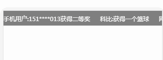

## Vue 实现跑马灯效果

### 前言

最近做活动需要做跑马灯效果，其他同事也有实现，本来打算复制他们代码，发现都是使用`setInterval`实现了，也没有封装为组件，所以自己用`CSS3`实现了一下跑马灯效果,并封装为组件,这样以后在需要写的时候,只需要引入组件就可以了。

### 实现的效果如下



### 实现思路

- `HTML` 结构父盒子固定,子盒子移动,并包含需要效果的内容
- 跑马灯效果 `CSS3` 实现肯定需要 `infinite` (循环执行动画)
- 运动前需要计算父盒子的宽度(`wrapWidth`),还有子盒子的总宽度(`offsetWidth`)
- 需要给定速度通过宽度计算出`CSS3`动画需要的时间`duration`

### 组件设计

向外暴露三个参数

- content: 因为滚动的数据大部分都是后台获取的,监听 content,当 content 有值的时候开始滚动(content 可以是任何类型数据)
- delay: 多久时开始执行动画只有第一次滚动时候生效(默认是 0.3s)
- speed: 速度(默认 100)

[github 地址源码地址](https://github.com/heyushuo/vue-marquee)

### 源码实现如下

源码中大部分都添加了注释,如有问题请指出谢谢

```Vue
<template>
  <div ref="wrap" class="wrap">
    <div ref="content" class="content" :class="animationClass" :style="contentStyle" @animationend="onAnimationEnd" @webkitAnimationEnd="onAnimationEnd">
      <slot></slot>
    </div>
  </div>
</template>
<script>
export default {
  props: {
    content: {
      default: ''
    },
    delay: {
      type: Number,
      default: 0.5
    },
    speed: {
      type: Number,
      default: 100
    }
  },
  mounted() {},
  data() {
    return {
      wrapWidth: 0,     //父盒子宽度
      firstRound: true, //判断是否
      duration: 0,      //css3一次动画需要的时间
      offsetWidth: 0,    //子盒子的宽度
      animationClass: '' //添加animate动画
    };
  },
  computed: {
    contentStyle() {
      return {
        //第一次从头开始,第二次动画的时候需要从最右边出来所以宽度需要多出父盒子的宽度
        paddingLeft: (this.firstRound ? 0 : this.wrapWidth) + 'px',
        //只有第一次的时候需要延迟
        animationDelay: (this.firstRound ? this.delay : 0) + 's',
        animationDuration: this.duration + 's'
      };
    }
  },
  watch: {
    content: {
      //监听到有内容,从后台获取到数据了,开始计算宽度,并计算时间,添加动画
      handler() {
        this.$nextTick(() => {
          const { wrap, content } = this.$refs;
          const wrapWidth = wrap.getBoundingClientRect().width;
          const offsetWidth = content.getBoundingClientRect().width;
          this.wrapWidth = wrapWidth;
          this.offsetWidth = offsetWidth;
          this.duration = offsetWidth / this.speed;
          this.animationClass = 'animate';
        });
      }
    }
  },
  methods: {
    //这个函数是第一次动画结束的时候,第一次没有使用infinite,第一次动画执行完成后开始使用添加animate-infinite动画
    onAnimationEnd() {
      this.firstRound = false;
      //这是时候样式多出了padding-left:this.wrapWidth;所以要想速度一样需要重新计算时间
      this.duration = (this.offsetWidth + this.wrapWidth) / this.speed;
      this.animationClass = 'animate-infinite';
    }
  }
};
</script>
<style scoped>
.wrap {
  width: 100%;
  height: 24px;
  overflow: hidden;
  position: relative;
  background: rgba(211, 125, 066, 1);
  position: relative;
  padding: 0;
}

.wrap .content {
  position: absolute;
  white-space: nowrap;
}

.animate {
  animation: paomadeng linear;
}

.animate-infinite {
  animation: paomadeng-infinite linear infinite;
}

@keyframes paomadeng {
  to {
    transform: translate3d(-100%, 0, 0);
  }
}

@keyframes paomadeng-infinite {
  to {
    transform: translate3d(-100%, 0, 0);
  }
}
</style>
```

### 把源码发布到 npm 上

请参考我的另外一篇文章,[如何将自己的 vue 组件发布为 npm 包](https://github.com/heyushuo/Blob/blob/master/JavaScript/10.%E5%A6%82%E4%BD%95%E5%B0%86%E8%87%AA%E5%B7%B1%E7%9A%84vue%E7%BB%84%E4%BB%B6%E5%8F%91%E5%B8%83%E4%B8%BAnpm%E5%8C%85.md)

### 使用方法

[github 如何使用地址和源码地址](https://github.com/heyushuo/vue-marquee)

```JavaScript
npm install heyushuo-marquee --save
import PaoMaDeng from 'heyushuo-marquee';
<PaoMaDeng :delay="0.5" :speed="100" :content="arr">
      <span v-for="(item, index) in arr" :key="index">{{item}}</span>
</PaoMaDeng>
```

[github 如何使用地址和源码地址](https://github.com/heyushuo/vue-marquee)
